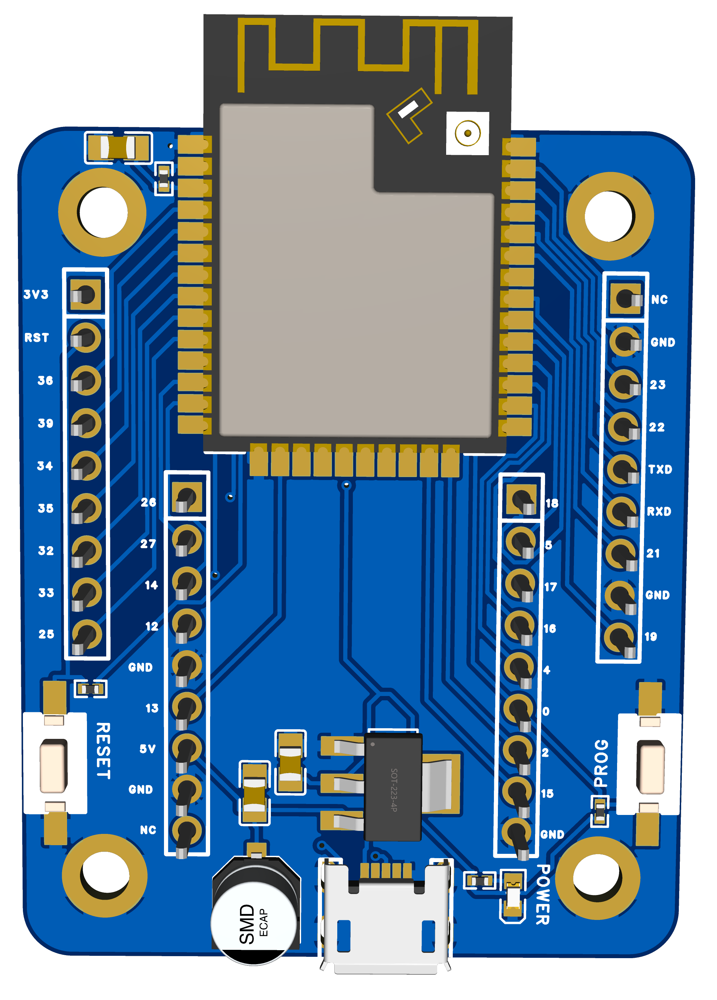
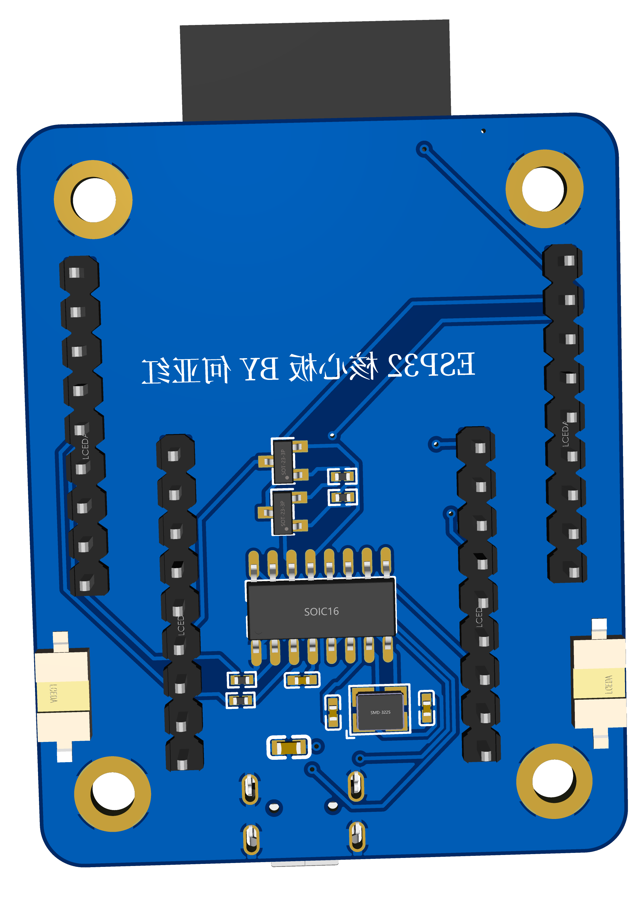
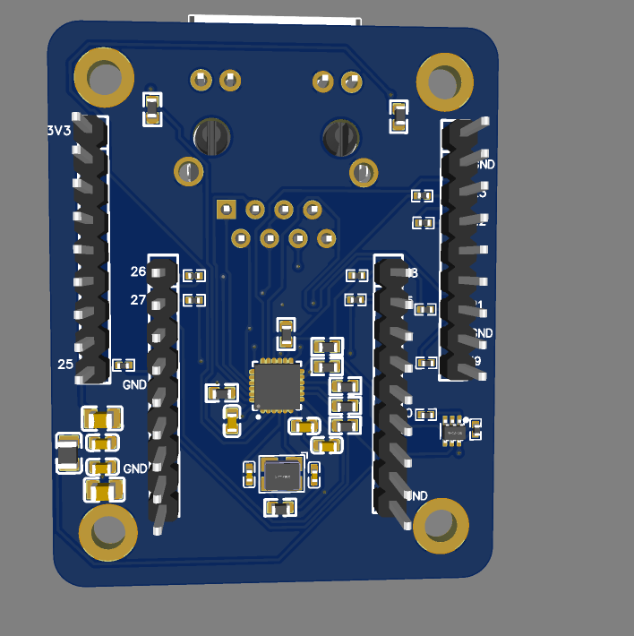
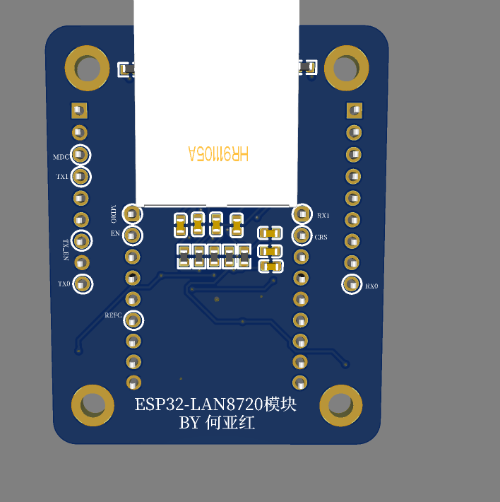

# 开发工具

采用立创EDA(专业版)作为PCB设计工具,官网地址:[https://pro.lceda.cn/](https://pro.lceda.cn/)

# 说明

对于模块而言，硬件设计仅供参考,主要用于验证固件代码。实际设计时，相关电路应当直接嵌入目标PCB中。

# 文件说明

## 核心板

### 2026-07-01

#### 立创EDA(专业版)工程

[ProPrj_ESP32Dev-Core-Pro_2026-07-01.epro2](ProPrj_ESP32Dev-Core-Pro_2026-07-01.epro2)

#### 原理图

[SCH_ESP32Dev-Core_2026-07-01.pdf](SCH_ESP32Dev-Core_2026-07-01.pdf)

注意:具体原理图请查看立创EDA(专业版)工程。

#### PCB

注意:具体PCB板请查看立创EDA(专业版)工程。

## LAN8720模块

### 2026-07-01

#### 立创EDA(专业版)工程

[ProPrj_ESP32Dev-LAN8720-Pro_2026-07-01.epro2](ProPrj_ESP32Dev-LAN8720-Pro_2026-07-01.epro2)

#### 原理图

[SCH_ESP32Dev-LAN8720_2026-07-01.pdf](SCH_ESP32Dev-LAN8720_2026-07-01.pdf)

注意:具体原理图请查看立创EDA(专业版)工程。

#### PCB

注意:具体PCB板请查看立创EDA(专业版)工程。

