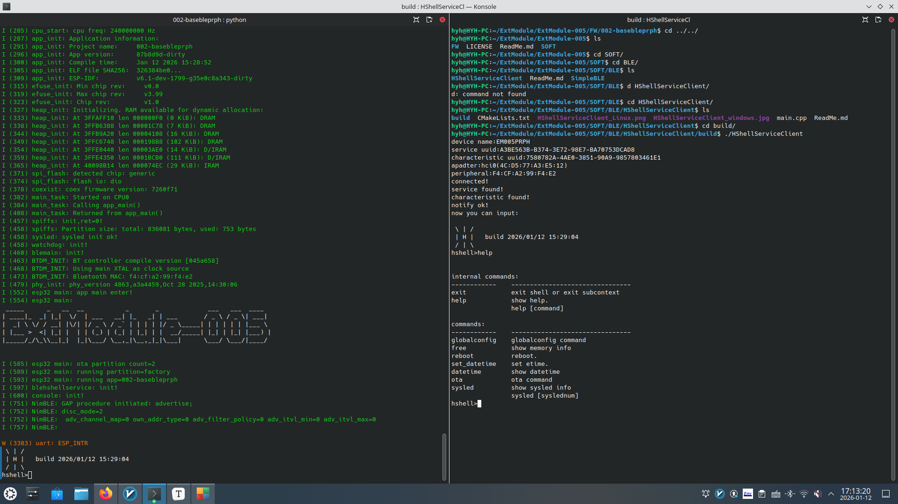

# 说明

HShellService的客户端。

此源代码适用于以下固件:

- [002-basebleprph](../../../FW/002-basebleprph)

本源代码采用[CMake](https://cmake.org)作为源代码管理工具。

# 源代码下载

由于本源代码包含第三方源代码,故直接下载可能有部分源代码缺失，需要通过以下方法解决:

- 在进行git clone 使用--recurse-submodules参数。

- 若已通过git clone下载,则在源代码目录中执行以下命令下载子模块:

  ```bash
   git submodule update --init --recursive
  ```

# 截图

## Linux

